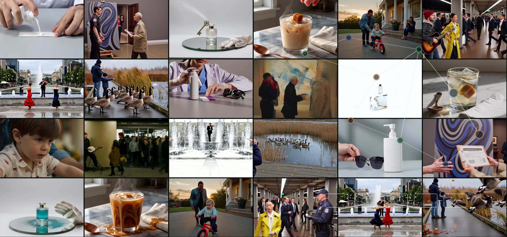
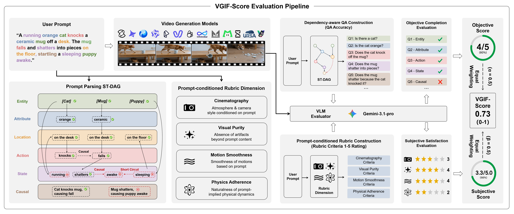
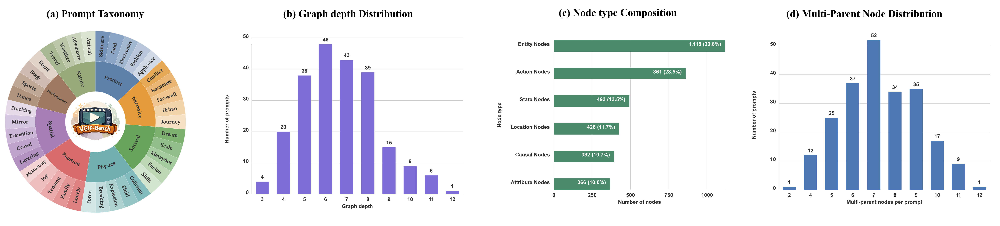
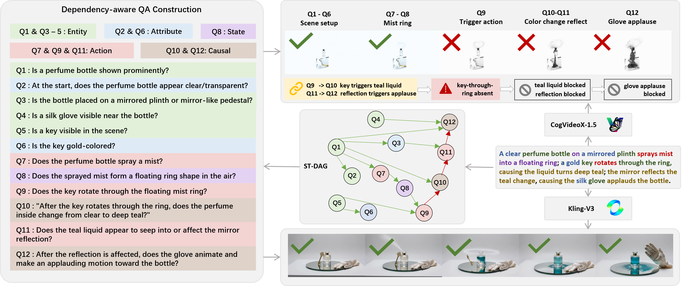

<div align="center">
  <h1>VGIF-Score</h1>
  <p><strong>Interpretable and Diagnostic Evaluation of Spatio-Temporal<br>Instruction Following in Video Generation</strong></p>
  <p>Songyu Xu, Xin Wang, Qiang Chen, Xinran Wang, Muxi Diao,<br>Yuxuan Zhang, Kongming Liang, Rui Lin, and Zhanyu Ma</p>
  <p>
    <a href="https://pris-cv.github.io/VGIF-SCORE/"></a>
    <a href="https://arxiv.org/abs/2607.13527"></a>
    <a href="https://huggingface.co/datasets/Notyourkev/VGIF-Bench"></a>
  </p>
  <p>
    
    
    
    
  </p>
</div>

<p align="center">
  <a href="https://pris-cv.github.io/VGIF-SCORE/"></a>
</p>
<p align="center"><sub>Generated video first frames across the eight VGIF-Bench macro domains. Open the project page for interactive diagnosis and leaderboards.</sub></p>

VGIF-Score evaluates whether a generated video completes the requested
spatio-temporal structure and whether the result satisfies prompt-conditioned
perceptual criteria. It combines dependency-aware QA over a Spatio-Temporal
Directed Acyclic Graph (ST-DAG) with an instruction-conditioned AutoRubric.

## At a Glance

| Prompts | Macro domains | Micro domains | ST-DAG nodes | Dependency edges | QA pairs | Models |
| ---: | ---: | ---: | ---: | ---: | ---: | ---: |
| **223** | **8** | **38** | **3,656** | **3,940** | **3,445** | **14** |

## How It Works

<p align="center">
  
</p>

- **Objective completion:** atomic entities, attributes, locations, actions,
  states, and causal relations are evaluated with dependency-aware QA.
- **Subjective satisfaction:** four prompt-specific AutoRubric dimensions
  evaluate cinematography, visual purity, motion smoothness, and physics
  adherence on a 1-5 scale.
- **Interpretable diagnosis:** failures are localized to ST-DAG nodes and
  propagated through their Boolean dependencies instead of being hidden by a
  single holistic score.

## Score Definition

For a video and prompt pair, the objective score is the fraction of QA nodes
that both match the expected answer and satisfy their recursive AND/OR
dependencies.

The subjective branch uses four integer ratings from 1 to 5:

- `Cin`: cinematography
- `Pur`: visual purity
- `Mot`: motion smoothness
- `Phy`: physics adherence

The four ratings are averaged and divided by the maximum rating of 5. This is
equivalent to normalizing each rating with `rating / 5` and then averaging:

```text
S_subjective = mean(rating_k) / 5
VGIF-Score = 0.5 * S_objective + 0.5 * S_subjective
```

All three benchmark-level scores use sample macro-averaging. For each matched
prompt-video pair, the evaluator first computes `S_objective`, `S_subjective`,
and `VGIF-Score`; the benchmark reports the arithmetic mean of each per-sample
quantity over the same sample set. It does not pool QA nodes across videos when
computing the benchmark-level objective or VGIF score.

The six semantic diagnostic columns use a different aggregation rule, as
specified in the paper. For Entity, Attribute, Location, Action, State, and
Causal, accuracy is pooled over all dependency-aware QA nodes of that type:

```text
type_accuracy(t) = correct dependency-aware QA nodes of type t
                   / all evaluated QA nodes of type t
```

A node is correct only when its own answer matches and its recursive Boolean
dependency expression passes. AND requires every parent, OR requires at least
one parent, and parent failure propagates through downstream dependencies. QA
dependencies are evaluated as a DAG and need not follow JSON list order.

Legacy result files may contain a fifth `Rub` field. It is not part of the
paper score and is ignored by the current scoring code.

## Benchmark Coverage

<p align="center">
  
</p>

VGIF-Bench spans eight macro domains and 38 fine-grained capabilities. The
camera-ready figure above summarizes category coverage, graph depth, node-type
distribution, and structural entanglement.

## Interactive Diagnosis

<p align="center">
  <a href="https://pris-cv.github.io/VGIF-SCORE/#case-explorer"></a>
</p>

The [interactive case explorer](https://pris-cv.github.io/VGIF-SCORE/#case-explorer)
contains one curated prompt for every macro domain, with 16 generated videos
from eight model families. Each case connects its atomic ST-DAG to per-node
pass, miss, and dependency-blocked states. The project page also includes an
[interactive benchmark comparison](https://pris-cv.github.io/VGIF-SCORE/#benchmark-comparison),
the aggregate paper leaderboard, and an interactive 8/38-domain analysis;
bulk per-sample benchmark outputs are not published.

## Repository Layout

```text
code/
  benchmark/   Canonical dataset validation/export and result manifests
  evaluation/  VLM QA, AutoRubric, aggregation, and VGIF scoring
  generation/  Provider-specific and open-model generation scripts
  plotting/    Paper analysis and figure scripts
data/
  autorubric/  Canonical 223-prompt source annotations
  vgif_bench/  Hugging Face-ready JSONL export and statistics
  final_qa/    Curated QA outputs
models/        Local generated videos and raw evaluation outputs (not for Git)
docs/          Static project page and camera-ready figure assets
camera_ready_paper_id_499/  Camera-ready PDF and LaTeX sources
```

## Setup

```powershell
python -m venv .venv
.venv\Scripts\Activate.ps1
python -m pip install -r requirements.txt
```

Copy `.env.example` to a local `.env` or set the variables in your shell. The
scripts do not load `.env` automatically.

```powershell
$env:VGIF_API_KEY = "..."
$env:VGIF_BASE_URL = "https://your-gemini-compatible-gateway"
```

Never commit credentials. A credential previously embedded in historical
scripts was removed and must be revoked at its provider before publication.

## Validate and Export VGIF-Bench

```powershell
python code/benchmark/build_vgif_bench.py --validate-only
python code/benchmark/build_vgif_bench.py
python code/benchmark/build_project_page_data.py
```

The second command writes `data/vgif_bench/vgif_bench.jsonl` and
`dataset_info.json`. It normalizes the historical `visual_purity` alias to the
canonical `purity` field in the export.

Curated project-page videos and the multi-domain hero collage can be rebuilt
with `code/benchmark/export_project_page_media.py`; pass an FFmpeg executable
with `--ffmpeg` when it is not available on `PATH`.

## Load VGIF-Bench from Hugging Face

The canonical public dataset repository is `Notyourkev/VGIF-Bench`.
Authentication is not required for loading:

```python
from datasets import load_dataset

dataset = load_dataset("Notyourkev/VGIF-Bench", split="test")
print(dataset[0]["prompt"])
```

To download the canonical files for the repository scripts:

```powershell
hf download Notyourkev/VGIF-Bench `
  --repo-type dataset `
  --local-dir data\vgif_bench
```

## Build the Result Manifest

```powershell
python code/benchmark/build_results_manifest.py
```

The manifest records the selected QA and AutoRubric file for every model and
sample. Selection prefers valid structured outputs, curated `data/final_qa`
files for QA, Gemini 3.1 evaluations, dependency-round mode, and non-test
filenames. Missing or null-scored evaluations remain explicitly missing.

## Evaluate a Video

```powershell
python code/evaluation/evaluate_video_qa_accuracy.py `
  --video path\to\video.mp4 `
  --entries data\vgif_bench\vgif_bench.jsonl `
  --metadata-root path\to\metadata `
  --question-mode dependency-rounds

python code/evaluation/evaluate_video_autorubric_scores.py `
  --video path\to\video.mp4 `
  --entries data\vgif_bench\vgif_bench.jsonl `
  --metadata-root path\to\metadata
```

## Reproducibility Notes

- VGIF-Bench validation is strict against the camera-ready totals.
- The VLM evaluator used in the paper is Gemini-3.1-Pro.
- The current result manifest reports actual coverage rather than assuming 223
  valid outputs per model.
- `build_genmovie_benchmark_v1.py` is a historical 30-prompt narrative subset
  utility. It is not the canonical VGIF-Bench builder.
- Generation scripts require provider credentials and, for open models, their
  original model repositories and checkpoints.

## Tests

The core scoring, dependency propagation, and benchmark schema tests use only
the Python standard library:

```powershell
python -m unittest discover -s tests -v
```

## License

The software in this repository is released under the Apache License 2.0. See
`LICENSE`.

VGIF-Bench is distributed separately under the Creative Commons
Attribution-NonCommercial 4.0 International License (`CC BY-NC 4.0`). See
`data/vgif_bench/LICENSE`. The dataset license applies to prompts, ST-DAG
annotations, dependency-aware QA pairs, and AutoRubric specifications; it does
not replace the software license.

## Citation

```bibtex
@misc{xu2026vgifscoreinterpretablediagnosticevaluation,
  title={VGIF-Score: Interpretable and Diagnostic Evaluation of Spatio-Temporal Instruction Following in Video Generation},
  author={Songyu Xu and Xin Wang and Qiang Chen and Xinran Wang and Muxi Diao and Yuxuan Zhang and Kongming Liang and Rui Lin and Zhanyu Ma},
  year={2026},
  eprint={2607.13527},
  archivePrefix={arXiv},
  primaryClass={cs.CV},
  url={https://arxiv.org/abs/2607.13527},
}
```
