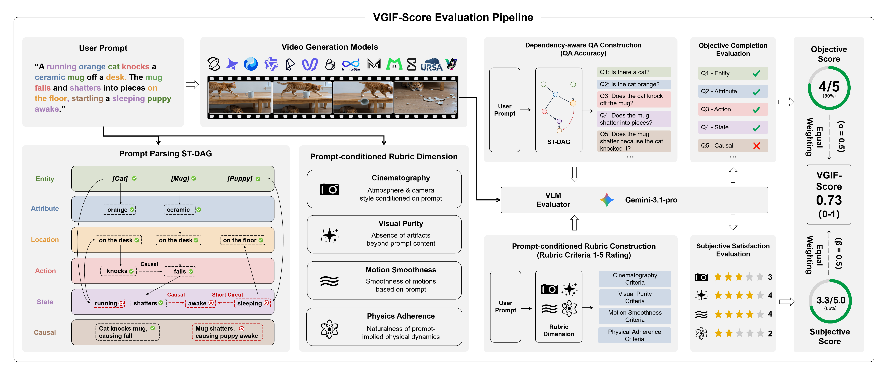
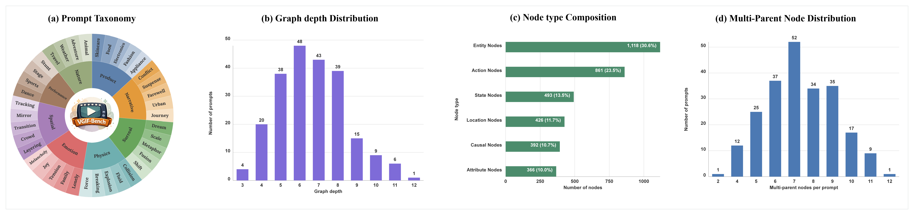
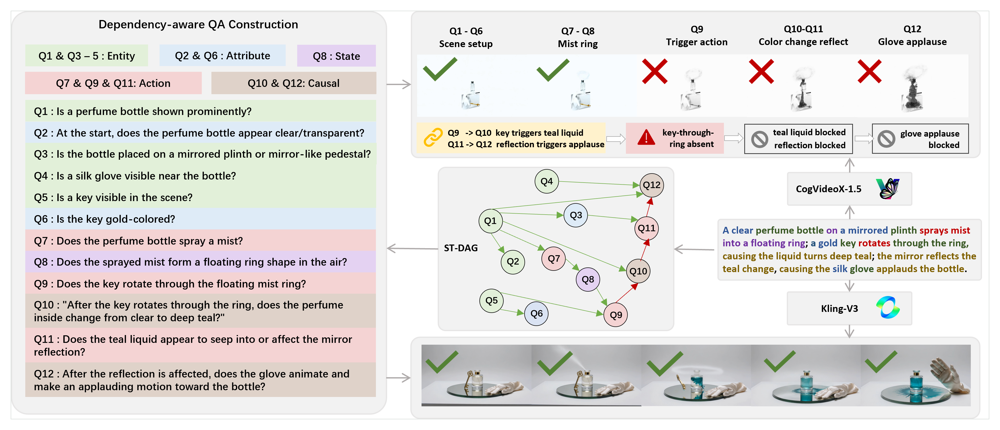

<div align="center">
  <h1>VGIF-Score</h1>
  <p><strong>Interpretable and Diagnostic Evaluation of Spatio-Temporal<br>Instruction Following in Video Generation</strong></p>
  <p>Songyu Xu, Xin Wang, Qiang Chen, Xinran Wang, Muxi Diao,<br>Yuxuan Zhang, Kongming Liang, Rui Lin, and Zhanyu Ma</p>
  <p>
    <a href="https://pris-cv.github.io/VGIF-SCORE/"></a>
    <a href="https://arxiv.org/abs/2607.13527"></a>
    <a href="https://huggingface.co/datasets/Notyourkev/VGIF-Bench"></a>
  </p>
  <p>
    
    
    
    
  </p>
</div>

<p align="center">
  <a href="https://pris-cv.github.io/VGIF-SCORE/"></a>
</p>
<p align="center"><sub>Generated video frames across the eight VGIF-Bench macro domains. Open the project page for interactive diagnosis and leaderboards.</sub></p>

## A Beautiful Video Can Still Miss the Instruction

Modern video generators can produce a convincing scene while quietly dropping
the event that should trigger it, changing the wrong object, or breaking the
requested temporal order. A single similarity or quality score can say that
the video is weak, but rarely says **what failed and why**.

VGIF-Score treats an instruction as a structured sequence of visible
commitments. It asks whether each commitment appears, whether its prerequisites
are satisfied, and whether the finished video remains perceptually convincing.
The result is both a score and a traceable diagnosis.

## From Prompt to Diagnosis

<p align="center">
  
</p>

1. **Structure the instruction.** The prompt becomes a Spatio-Temporal Directed
   Acyclic Graph (ST-DAG) of entities, attributes, locations, actions, states,
   and causal relations.
2. **Ask atomic questions.** A VLM checks each visible requirement. Dependency
   expressions preserve the prompt's logic, so a missed trigger explains why a
   downstream event cannot receive credit.
3. **Judge the requested presentation.** An instruction-conditioned AutoRubric
   evaluates cinematography, visual purity, motion smoothness, and physics
   adherence with prompt-specific 1-5 anchors.
4. **Combine completion and satisfaction.** Objective and subjective scores are
   computed for every prompt-video pair, combined with equal weight, and then
   averaged over the benchmark.

```text
S_objective  = completed dependency-aware nodes / all nodes
S_subjective = mean(Cin, Pur, Mot, Phy) / 5
VGIF-Score   = 0.5 * S_objective + 0.5 * S_subjective
```

## VGIF-Bench

| Prompts | Macro domains | Micro domains | ST-DAG nodes | Dependency edges | QA pairs | Models |
| ---: | ---: | ---: | ---: | ---: | ---: | ---: |
| **223** | **8** | **38** | **3,656** | **3,940** | **3,445** | **14** |

<p align="center">
  
</p>

VGIF-Bench is built around long, dependency-rich prompts rather than isolated
visual attributes. Its eight macro domains cover product showcase, narrative,
surreal expression, physical interaction, emotion, spatial orchestration,
embodied performance, and the living world.

## Read a Failure Trace

<p align="center">
  <a href="https://pris-cv.github.io/VGIF-SCORE/#case-explorer"></a>
</p>

A generated result may contain the right subject and scene yet miss the action
that initiates the requested transformation. VGIF-Score isolates that missed
node and marks the dependent states as blocked, instead of folding every error
into one opaque number.

The [interactive case explorer](https://pris-cv.github.io/VGIF-SCORE/#case-explorer)
contains one curated prompt per macro domain, with 16 videos from eight model
families. The project page also provides the
[benchmark comparison](https://pris-cv.github.io/VGIF-SCORE/#benchmark-comparison),
[model leaderboard](https://pris-cv.github.io/VGIF-SCORE/#leaderboard), and
interactive 8/38-domain analysis. Bulk per-sample benchmark outputs are not
published.

## Use the Code

### 1. Install

```powershell
python -m venv .venv
.venv\Scripts\Activate.ps1
python -m pip install -r requirements.txt
```

Set the VLM endpoint used by the evaluation scripts:

```powershell
$env:VGIF_API_KEY = "..."
$env:VGIF_BASE_URL = "https://your-gemini-compatible-gateway"
```

Keep credentials local and never commit them.

### 2. Load VGIF-Bench

```python
from datasets import load_dataset

dataset = load_dataset("Notyourkev/VGIF-Bench", split="test")
print(dataset[0]["prompt"])
```

The public dataset repository does not require authentication for loading.

### 3. Validate and Export

```powershell
python code/benchmark/build_vgif_bench.py --validate-only
python code/benchmark/build_vgif_bench.py
python code/benchmark/build_results_manifest.py
python code/benchmark/build_project_page_data.py
```

### 4. Evaluate a Video

```powershell
python code/evaluation/evaluate_video_qa_accuracy.py `
  --video path\to\video.mp4 `
  --entries data\vgif_bench\vgif_bench.jsonl `
  --metadata-root path\to\metadata `
  --question-mode dependency-rounds

python code/evaluation/evaluate_video_autorubric_scores.py `
  --video path\to\video.mp4 `
  --entries data\vgif_bench\vgif_bench.jsonl `
  --metadata-root path\to\metadata
```

The paper evaluation uses Gemini-3.1-Pro. Objective, subjective, and VGIF
scores are computed per sample before benchmark averaging. Semantic node-type
diagnostics pool the dependency-aware QA decisions for each node type.

### 5. Run the Tests

```powershell
python -m unittest discover -s tests -v
```

## Repository Map

```text
code/
  benchmark/   Dataset validation, result manifests, and project-page exports
  evaluation/  VLM QA, AutoRubric, dependency propagation, and VGIF scoring
  generation/  Provider-specific and open-model generation scripts
  plotting/    Paper analysis and figure scripts
data/
  autorubric/  Canonical 223-prompt source annotations
  vgif_bench/  Hugging Face-ready JSONL export and statistics
  final_qa/    Curated QA outputs
models/        Local generated videos and evaluation outputs (not for Git)
docs/          Static project page, curated videos, and camera-ready figures
camera_ready_paper_id_499/  Camera-ready PDF and LaTeX sources
```

Curated project-page media can be rebuilt with
`code/benchmark/export_project_page_media.py`. README images with a stable
white matte can be rebuilt with `code/benchmark/export_readme_media.py`.

## License

The software is released under the Apache License 2.0. VGIF-Bench is released
separately under Creative Commons Attribution-NonCommercial 4.0 International
(`CC BY-NC 4.0`). See `LICENSE` and `data/vgif_bench/LICENSE`.

## Citation

```bibtex
@misc{xu2026vgifscoreinterpretablediagnosticevaluation,
  title={VGIF-Score: Interpretable and Diagnostic Evaluation of Spatio-Temporal Instruction Following in Video Generation},
  author={Songyu Xu and Xin Wang and Qiang Chen and Xinran Wang and Muxi Diao and Yuxuan Zhang and Kongming Liang and Rui Lin and Zhanyu Ma},
  year={2026},
  eprint={2607.13527},
  archivePrefix={arXiv},
  primaryClass={cs.CV},
  url={https://arxiv.org/abs/2607.13527},
}
```
